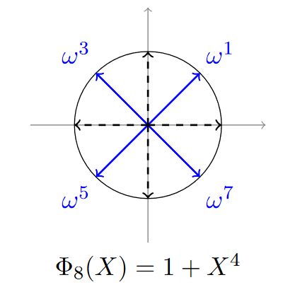

# Vanilla Encoding example

여기서는 $z \in \mathbb{C}^N$를 다항식 $m(X) \in \mathbb{C}[X]/(X^N + 1)$로 encoding하는 간단한 경우를 다룰 것입니다.

이를 위해 $\sigma: \mathbb{C}[X]/(X^N + 1) \rightarrow \mathbb{C}^N$이라는 canonical embedding을 사용할 것인데, 이는 벡터를 decoding하고 encoding합니다.

다항식 $m(X)$을 vector $z$로 decoding하려면 이 다항식을 특정 값에서 평가해야 하는데, 이 값은 cyclotomic polynomial $\Phi_M(X) = X^N + 1$의 root일 것입니다. 이 $N$개의 root는 $\xi, \xi^3, ..., \xi^{2N-1}$입니다.

따라서 다항식 $m(X)$을 decoding하려면 $\sigma(m) = (m(\xi), m(\xi^3), ..., m(\xi^{2N-1})) \in \mathbb{C}^N$으로 정의합니다. $\sigma$는 isomorphism을 정의하는데, 이는 bijective homomorphism으로, 따라서 어떤 벡터든지 해당하는 다항식으로 고유하게 encoding되고 그 반대도 성립합니다.

여기서 $\sigma$는 decoding이므로, 역함수 $\sigma^{-1}$을 계산하는 것은 vector $z \in \mathbb{C}^N$를 해당 다항식으로 encoding하는 것이 됩니다. 따라서 문제는 vector $z \in \mathbb{C}^N$가 주어졌을 때 다항식 $m(X) = \sum_{i=0}^{N-1} \alpha_i X^i \in \mathbb{C}[X]/(X^N + 1)$을 찾는 것인데, 이 때 $\sigma(m) = (m(\xi), m(\xi^3), ..., m(\xi^{2N-1})) = (z_1, ..., z_N)$가 됩니다.

이를 더 깊게 파헤치면 다음과 같은 시스템이 나옵니다:

$$\sum_{j=0}^{N-1} \alpha_j (\xi^{2i-1})^j = z_i, \quad i=1, ..., N.$$

이는 다음과 같은 선형 방정식으로 볼 수 있습니다:

$$A \alpha = z$$

여기서 $A$는 $(\xi^{2i-1})_{i=1}^{N}$의 Vandermonde 행렬이고, $\alpha$는 다항식 계수의 벡터이며, $z$는 encoding하려는 벡터입니다.

따라서 $\alpha = A^{-1}z$이고, $\sigma^{-1}(z) = \sum_{i=0}^{N-1} \alpha_i X^i \in \mathbb{C}[X]/(X^N + 1)$임을 알 수 있습니다.

여기서 $M=8$, $N=\frac{M}{2}=4$, $\Phi_M(X)=X^4+1$, 그리고 $\omega=e^{\frac{2i\pi}{8}}=e^{\frac{i\pi}{4}}$로 두겠습니다. 목표는 다음 벡터들을 encoding하고 decoding한 후, 그 다항식을 더하고 곱한 다음 이를 다시 decoding하는 것입니다: $[1, 2, 3, 4]$ 및 $[-1, -2, -3, -4]$.



다항식을 decoding하기 위해서는 단순히 power of an $M$-th root of unity에서 평가하면 됩니다. 여기서는 $\xi_M = \omega = e^{i\pi/4}$를 선택합니다.

$\xi$와 $M$이 주어지면 $\sigma$ 및 그 역함수 $\sigma^{-1}$을 정의할 수 있습니다. 각각 decoding과 encoding을 나타냅니다.

```Python
import numpy as np
from numpy.polynomial import Polynomial

np.set_printoptions(precision=3)    # 소수점 3자리만 출력하도록 setting
```

## Vanilla Encoder Class 선언

```Python
class CKKSEncoder:
    """Basic CKKS encoder to encode complex vectors into polynomials."""

    def __init__(self, M: int):
        """
        Initialization of the encoder for M a power of 2.
        xi, which is an M-th root of unity will, be used as a basis for our computations.
        """
        # ========================= EDIT HERE =========================
        self.xi = np.exp(2 * np.pi * 1j / M)
        # =============================================================
        self.M = M

    @staticmethod
    def vandermonde(xi: np.complex128, M: int) -> np.array:
        """Computes the Vandermonde matrix from a m-th root of unity."""
        N = M // 2
        matrix = []
        # We will generate each row of the matrix
        for i in range(N):
            # For each row we select a different root
            # ========================= EDIT HERE =========================
            root = xi ** (2 * i + 1)
            # =============================================================
            row = []

            # Then we store its powers
            for j in range(N):
                # ========================= EDIT HERE =========================
                row.append(root ** j)
                # =============================================================
            matrix.append(row)
        return matrix

    def sigma_inverse(self, b: np.array) -> 'Polynomial':
        """Encodes the vector b in a polynomial using an M-th root of unity."""

        # First we create the Vandermonde matrix
        A = CKKSEncoder.vandermonde(self.xi, self.M)

        # Then we solve the system
        """
        선형 방정식 Mx = y의 해는 np.linalg.solve(M, y)로 구할 수 있습니다.
        """
        # ========================= EDIT HERE =========================
        coeffs = np.linalg.solve(A, b)
        # =============================================================

        # Finally we output the polynomial
        p = Polynomial(coeffs)
        return p

    def sigma(self, p: Polynomial) -> np.array:
        """Decodes a polynomial by applying it to the M-th roots of unity."""

        outputs = []
        N = self.M //2

        # We simply apply the polynomial on the roots
        for i in range(N):
            # ========================= EDIT HERE =========================
            root = self.xi ** (2 * i + 1)
            # =============================================================
            output = p(root)
            outputs.append(output)
        return np.array(outputs)
```

```Python
# Set the parameters
M = 8

# Initialize our encoder
encoder = CKKSEncoder(M)
```

### Vandermonde matrix란?

```Python
"""What is Vandermonde matrix?"""
matrix = encoder.vandermonde(encoder.xi, encoder.M)
print(np.array(matrix))
```

```
[[ 1.   +0.j     0.707+0.707j  0.   +1.j    -0.707+0.707j]
 [ 1.   +0.j    -0.707+0.707j  0.   -1.j     0.707+0.707j]
 [ 1.   +0.j    -0.707-0.707j  0.   +1.j     0.707-0.707j]
 [ 1.   +0.j     0.707-0.707j  0.   -1.j    -0.707-0.707j]]
```

### Polynomial로 Encoding

```Python
b = np.array([1, 2, 3, 4])
p = encoder.sigma_inverse(b)
Polynomial(p.coef.round(3))
```

$ x ↦ (2.5+0j)+((-0+0.707j))x+((-0+0.5j))x^2+(0.707j)x^3 $

### Decoding

```Python
b_reconstructed = encoder.sigma(p)
b_reconstructed
```

```
array([1.+1.110e-16j, 2.+1.110e-16j, 3.+5.551e-17j, 4.-2.220e-16j])$
```

### Error

```Python
np.linalg.norm(b_reconstructed - b)
```

$2.7755575615628914e-16$

## Addition

```Python
m1 = np.array([1, 2, 3, 4])
m2 = np.array([1, -2, 3, -4])

p1 = encoder.sigma_inverse(m1)
p2 = encoder.sigma_inverse(m2)
```

```Python
Polynomial(p1.coef.round(3))
```

$x ↦ (2.5+0j) + ((-0+0.707j))x + ((-0+0.5j))x^2 + (0.707j)x^3$

```Python
Polynomial(p2.coef.round(3))
```

$x ↦ (-0.5+0j)+((-0.707+0j))x+(-2.5j)x^2+((0.707+0j))x^3$

```Python
p_add = p1 + p2
Polynomial(p_add.coef.round(3))
```

$x ↦ (2+0j)+((-0.707+0.707j))x+((-0-2j))x^2+((0.707+0.707j))x^3$

### Decoding 결과

```Python
encoder.sigma(p_add)
```

```
array([ 2.000e+00-9.197e-17j, -8.882e-16+2.220e-16j,
        6.000e+00+2.220e-16j, -4.441e-16+0.000e+00j])
```

## Multiplication

```Python
poly_modulo = Polynomial([1, 0, 0, 0, 1])
poly_modulo
```

$x ↦ 1.0+0.0x+0.0x^2+0.0x^3+1.0x^4$

```Python
p_mult = p1 * p2
Polynomial(p_mult.coef.round(3))
```

$x↦(-1.25+0j)+((-1.768-0.354j))x+(-7j)x^2+((3.536-0.707j))x^3+((1.25+0j))x^4 +((1.768+0.354j))x^5+(0.5j)x^6$

이렇게 4차 함수를 넘어가기 때문에 위 다항식인 $x^4+1$(Cyclotomic polynomial)로 나눠주어야 한다.

```Python
p_mult = p1 * p2 % poly_modulo
Polynomial(p_mult.coef.round(3))
```

$ x↦(-2.5+0j)+((-3.536-0.707j))x+((-0-7.5j))x^2+((3.536-0.707j))x^3$

### Decoding 결과

```Python
encoder.sigma(p_mult)
```

```
array([  1.+7.216e-16j,  -4.+8.327e-16j,   9.-5.274e-15j, -16.-2.609e-15j])
```

## Reference

https://blog.openmined.org/ckks-explained-part-1-simple-encoding-and-decoding/
